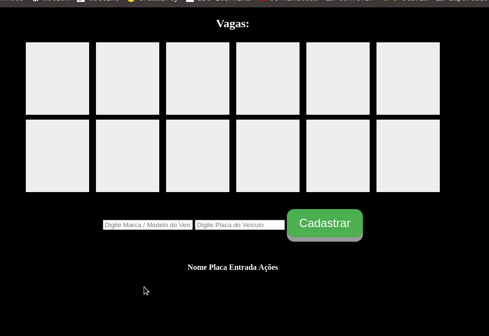

# Sistema de Estacionamento

Sistema de Estacionamento desenvolvido durante o bootcamp da Spread Fullstack Developer na dio.me.

Foram adicionadas diversas funcionalidades, desde seleção de vaga, bem como a visualização das vagas ocupadas e várias checagens de preenchimento de campos.

